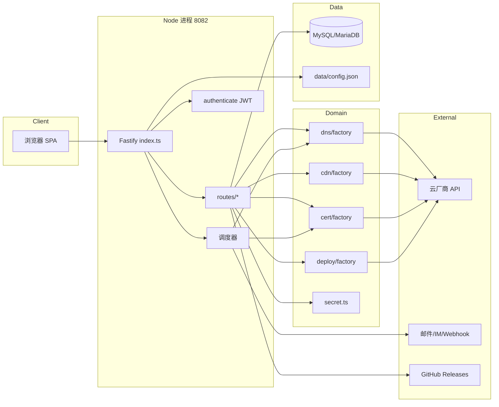
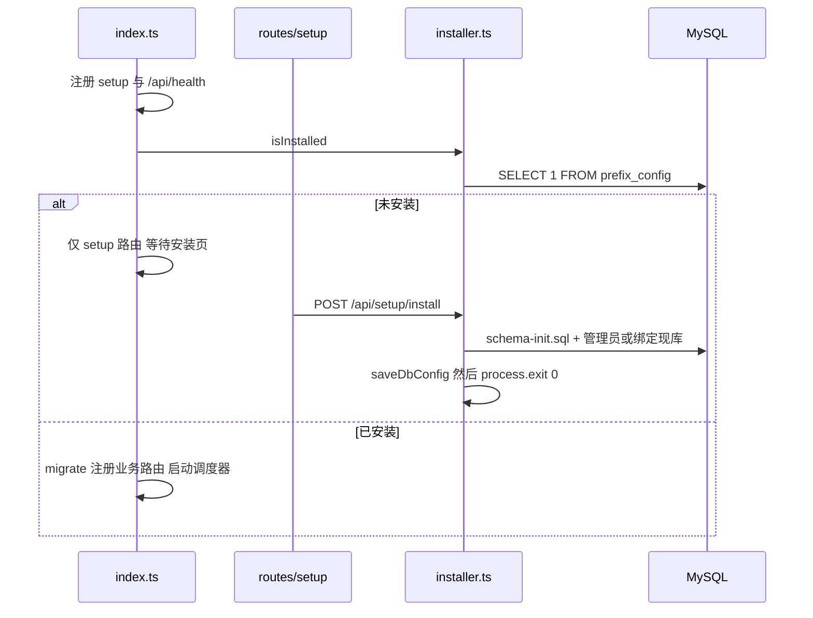
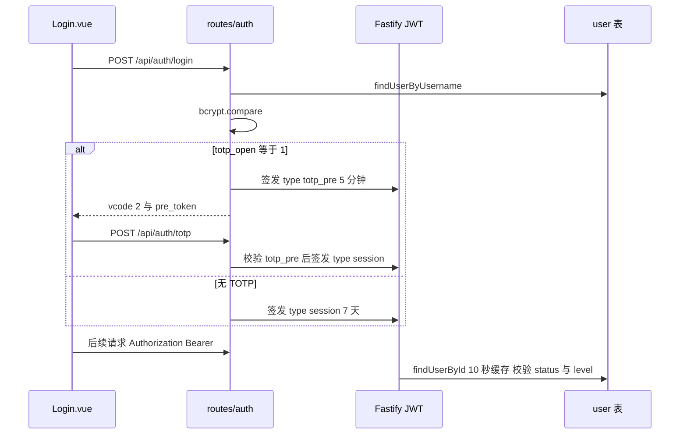
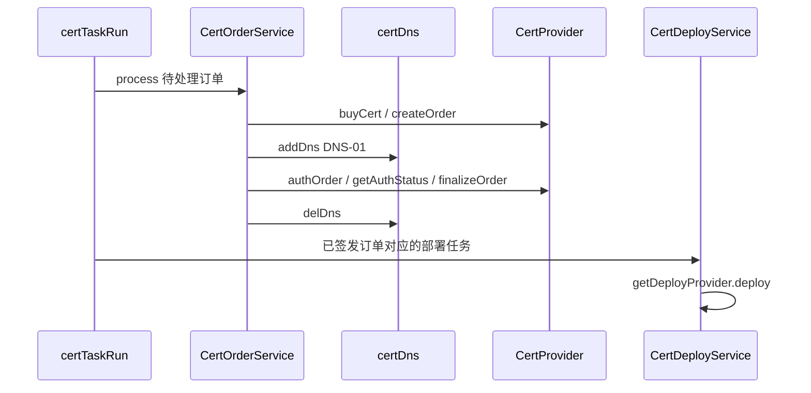

# 架构设计

## 概述

彩虹 DNS Pro（仓库名 `dnsmgr-Pro`，当前版本 1.1.3）是一套 DNS 解析、CDN 加速、SSL 证书申请与自动部署的一体化管理平台。目标用户是需要把多个云厂商的域名解析、加速域名和证书生命周期集中纳管的个人、企业运维与 IDC 集成方。

系统由 Node.js / TypeScript（Fastify）后端与 Vue 3 + Naive UI 前端组成。生产镜像把前端构建产物挂到后端同进程静态目录，对外只暴露端口 8082；开发时前端 Vite（5173）把 `/api` 反向代理到后端。数据存储使用 MySQL 5.7+ / MariaDB，表前缀默认 `dnsmgr_`，可直接绑定原彩虹 DNS（`netcccyun/dnsmgr`）现有库。

已安装状态下，进程在启动时执行幂等迁移，并拉起容灾监控、优选 IP、定时切换、到期提醒、CDN 预热、DNS 劫持检测、证书续签等调度器。账号凭据以 AES-256-GCM 加密落库（前缀 `enc:v1:`），JWT 会话令牌默认 7 天。

## 技术栈

**语言与运行时**
- TypeScript 5.5 / Node.js 22（容器基镜像 `node:22-alpine`）
- 后端以 `tsx` 直接运行 `backend/src/index.ts`（无独立编译产物）

**框架**
- 后端：Fastify 4.28、`@fastify/jwt`、`@fastify/cors`、`@fastify/static`
- 前端：Vue 3.4、Vue Router 4.3、Pinia 2.1、Naive UI 2.39、Vite 5.3、ECharts 5.6

**数据存储**
- MySQL / MariaDB（连接池 `mysql2`，上限 10）
- 安装配置持久化到 `data/config.json`（权限 0600）
- 证书处理日志写到 `backend/src/runtime/log`（运行时目录）

**基础设施**
- Docker 多阶段构建（`Dockerfile`）
- Docker Compose（`docker-compose.yml`，服务名 `dnsmgr-refactor`）
- Kubernetes 清单 `deploy/kubernetes.yaml`（Namespace `dnsmgr-pro`，ClusterIP 8082）
- GitHub Actions `.github/workflows/docker-build.yml` 推送 Docker Hub `ssdxftx/dnsmgr-pro` 与 GHCR

**外部服务**
- 22 个 DNS 厂商、12 个 CDN 厂商、8 个证书签发渠道、49 个证书部署目标
- 通知通道：SMTP / SendCloud、WxPusher、Telegram、钉钉、飞书、企业微信、Webhook
- 更新检查：GitHub Releases（默认仓库 `ssdxftx/dnsmgr-Pro`）

## 项目结构

```
dnsmgr-Pro/
├── backend/                 # Fastify API + 调度器
│   ├── package.json         # 版本与脚本（dev/start）
│   └── src/
│       ├── index.ts         # 进程入口
│       ├── auth.ts          # 用户查询、密码、域名权限
│       ├── config.ts / config-loader.ts
│       ├── db.ts            # mysql2 连接池
│       ├── installer.ts     # 安装 / 绑定现库
│       ├── migrate.ts       # 启动幂等迁移
│       ├── security.ts      # 安全头与限流
│       ├── routes/          # HTTP 路由插件（17 个）
│       ├── sql/schema-init.sql
│       └── lib/             # 业务实现与厂商 SDK
├── frontend/                # Vue 3 SPA
│   ├── vite.config.ts       # 5173 + /api 代理 8082
│   └── src/
│       ├── main.ts / App.vue / router.ts / api.ts
│       ├── layouts/MainLayout.vue
│       ├── stores/auth.ts
│       ├── lib/             # admin.ts / back.ts / safe.ts
│       └── views/           # 36 个页面
├── scripts/release.mjs      # 版本同步 + 打标签 + 推送
├── deploy/kubernetes.yaml
├── Dockerfile
├── docker-compose.yml
└── .env.example
```

**入口点**
- `backend/src/index.ts`：HTTP 服务、鉴权装饰器、路由注册、调度器
- `frontend/src/main.ts`：Vue 应用启动
- `frontend/src/router.ts`：页面路由与安装/登录/管理员守卫
- `scripts/release.mjs`：发布入口

## 子系统

### HTTP 入口与安全层
**目的**: 监听 8082、挂安全头/限流/JWT、按安装状态决定是否加载业务路由。
**位置**: `backend/src/index.ts`、`backend/src/security.ts`、`backend/src/auth.ts`
**关键文件**: `index.ts`、`security.ts`、`routes/setup.ts`
**依赖**: Fastify、`sys_key`、`data/config.json`
**被依赖**: 全部业务路由

### DNS 解析
**目的**: 统一管理多厂商域名与解析记录，供前端、容灾、定时切换、证书 DNS-01 共用。
**位置**: `backend/src/lib/dns/`、`backend/src/routes/domain.ts`、`backend/src/routes/account.ts`
**关键文件**: `lib/dns/factory.ts`、`lib/dns/types.ts`、`lib/dns/providers/*.ts`
**依赖**: `lib/clients/*`、`lib/secret.ts`
**被依赖**: 容灾、定时切换、优选 IP、证书 DNS 验证、CDN 自动写 CNAME

### CDN 加速
**目的**: 加速域名接入、源站/缓存/HTTPS、刷新预热、统计、证书联动。
**位置**: `backend/src/lib/cdn/`、`backend/src/routes/cdn.ts`、`backend/src/routes/preheat.ts`
**关键文件**: `lib/cdn/factory.ts`、`lib/cdn/certLink.ts`、`lib/cdn/statistics/*`
**依赖**: DNS 账户（写 CNAME）、证书模块（certlink）
**被依赖**: 前端 CDN 页面、预热调度器

### SSL 证书与部署
**目的**: 申请/续签证书，并把证书部署到 49 个目标。
**位置**: `backend/src/lib/cert/`、`backend/src/lib/deploy/`、`backend/src/lib/certService.ts`、`backend/src/lib/deployService.ts`、`backend/src/routes/cert.ts`
**关键文件**: `lib/cert/factory.ts`、`lib/cert/certTaskService.ts`、`lib/deploy/factory.ts`、`lib/deploy/meta.ts`
**依赖**: DNS provider（DNS-01）、ACME（`lib/acme/`）、`commandGuard.ts`
**被依赖**: CDN certlink、到期/失败通知

### 容灾、定时切换、优选 IP
**目的**: 按探测结果或时间表改解析；从外部接口拉取 Cloudflare 优选 IP。
**位置**: `backend/src/lib/monitor/`、`backend/src/lib/schedule/`、`backend/src/lib/optimize/`
**关键文件**: `monitor/scheduler.ts`、`monitor/taskRunner.ts`、`schedule/scheduleService.ts`、`optimize/optimizeService.ts`
**依赖**: DNS provider、`netGuard.ts`、`msgNotice.ts`
**被依赖**: `index.ts` 调度循环、对应路由

### 用户、权限与通知
**目的**: 多用户、域名级授权、自助注册、TOTP、操作日志、多通道告警。
**位置**: `backend/src/routes/user.ts`、`register.ts`、`auth.ts`、`system.ts`、`lib/totp.ts`、`lib/monitor/msgNotice.ts`
**关键文件**: `auth.ts`、`routes/auth.ts`、`lib/secret.ts`
**依赖**: `user` / `permission` / `log` / `reg_code` 表
**被依赖**: 几乎所有需登录的路由

### 前端 SPA
**目的**: 管理界面与安装向导。
**位置**: `frontend/src/`
**关键文件**: `router.ts`、`api.ts`、`layouts/MainLayout.vue`、`lib/admin.ts`、`lib/back.ts`
**依赖**: `/api`（Bearer JWT）
**被依赖**: 生产环境由 Fastify static 托管 `frontend/dist`

## 架构图



## 关键流程

### 启动与安装



### 登录与会话



### 证书签发与部署



## 设计决策

| 决策 | 实现位置 | 说明 |
|------|----------|------|
| 单进程同源部署 | `index.ts` + Dockerfile | 前端 dist 由 Fastify static 托管，生产只开 8082 |
| 兼容彩虹 DNS 表结构 | `sql/schema-init.sql`、`installer.ts` | 现库直接绑定，不覆盖数据 |
| 启动幂等迁移 | `migrate.ts` | `CREATE TABLE IF NOT EXISTS` + `ensureColumn` |
| 凭据加密兼容明文 | `lib/secret.ts` | `enc:v1:` AES-256-GCM，读明文、下次保存转密文 |
| JWT 只用 session | `index.ts` authenticate | 拒绝 `totp_pre` 等一次性令牌 |
| 部署自定义命令默认关 | `lib/deploy/commandGuard.ts` | `DNSMGR_ALLOW_DEPLOY_CMD=1` 才执行 cmd |
| SSRF 默认拦内网 | `lib/netGuard.ts` | `DNSMGR_ALLOW_PRIVATE_FETCH=1` 才放行 |
| 发布必须用脚本 | `scripts/release.mjs` | git 标签与 `backend/package.json` 版本必须一致 |
| CI 默认只构建 amd64 | `docker-build.yml` | 避免 QEMU arm64 长时间构建 |
