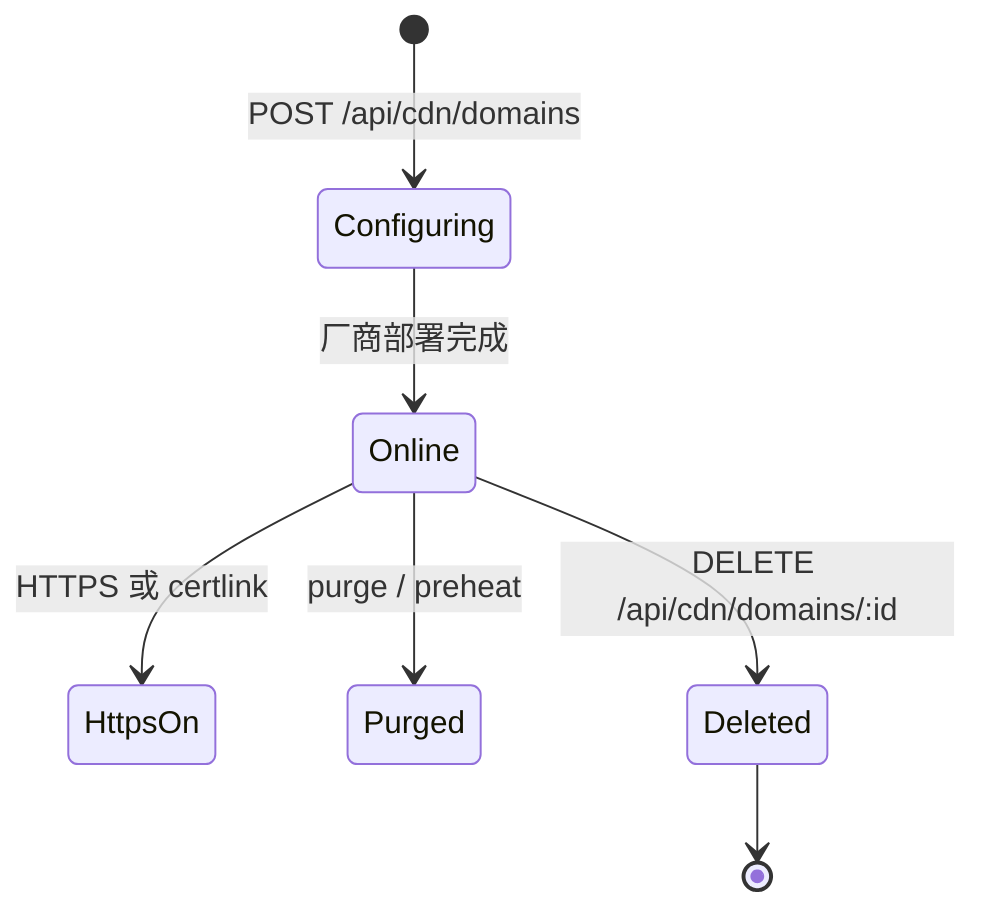

# CDN 加速域名

加速域名把流量接到腾讯 CDN/EdgeOne、阿里 CDN/ESA 等 12 家厂商。接入成功后系统可向对应 DNS 账户写入 CNAME；证书可通过平台免费证书、本系统签发联动（certlink）或云厂商申请完成 HTTPS。

## 什么是 CDN 加速域名？

一条 `cdn_domain` 记录，绑定 `cdn_account`，保存源站、区域、CNAME、HTTPS 开关和 `cert_mode`。站点型厂商（EdgeOne、ESA）还需要 `zone_id`。

**关键特征**:
- 接入向导由 `cdnConfig.addFlow` 驱动（是否选站点、服务区域、回源字段）
- 缓存规则按厂商翻译（EdgeOne L7 规则、腾讯 CDN ttl=0 转 NoCache、阿里先删后下发）
- 统计目前实现四家：`tencentCdn`、`tencentEdgeOne`、`aliyunCdn`、`aliyunEsa`

## 代码位置

| 方面 | 位置 |
|------|------|
| 类型 | `backend/src/lib/cdn/types.ts` |
| 工厂 | `backend/src/lib/cdn/factory.ts` |
| 证书联动 | `backend/src/lib/cdn/certLink.ts` |
| 预热调度 | `backend/src/lib/cdn/preheatService.ts` |
| 路由 | `backend/src/routes/cdn.ts`、`preheat.ts`、`account.ts` |
| 表 | `cdn_account`、`cdn_domain`、`cdn_cache_rule`、`cdn_preheat_task`、`cdn_cache_task`、`cert_link_log` |

## 结构

```typescript
interface CdnDomainItem {
  domain: string;
  cname: string;
  status: string;
  zoneId?: string;
  origin?: string;
  https_enabled?: boolean;
  force_redirect?: boolean;
}

type CertMode = 'freecert' | 'certlink' | 'certapply' | null;
```

### 关键字段（表 `cdn_domain`）

| 字段 | 描述 |
|------|------|
| `aid` | CDN 账户 |
| `did` | 关联的 DNS 域名 ID，0 表示未关联 |
| `name` | 加速域名 |
| `zone_id` | 站点 ID |
| `origin` / `origin_type` / 端口 / 协议 | 回源 |
| `cname` | 厂商返回的 CNAME |
| `cert_mode` | 证书管理方式（`migrate.ts` 补列） |

## 不变量

1. **CNAME 写解析时线路用厂商默认**: 自动添加解析不再写死 `'default'`
2. **统计全部失败必须暴露真实错误**: 路由兜底 `{code:-1, msg:'统计查询异常：...'} `
3. **免费证书 pending 需完成域名验证记录后才能部署**

## 生命周期



证书联动进度写 `cert_link_log`（node + status + message），前端可轮询 `/api/cdn/domains/:id/certlink/log`。
