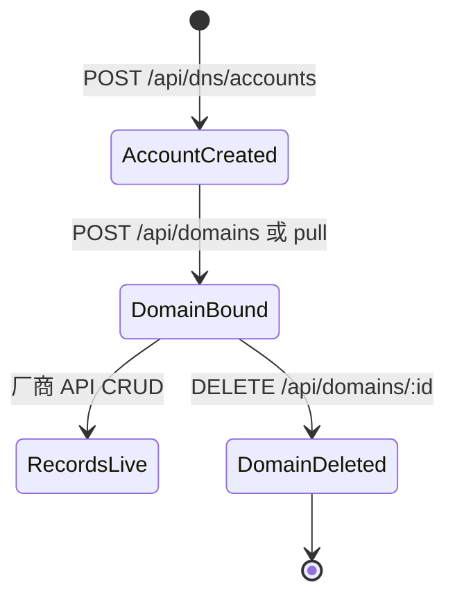
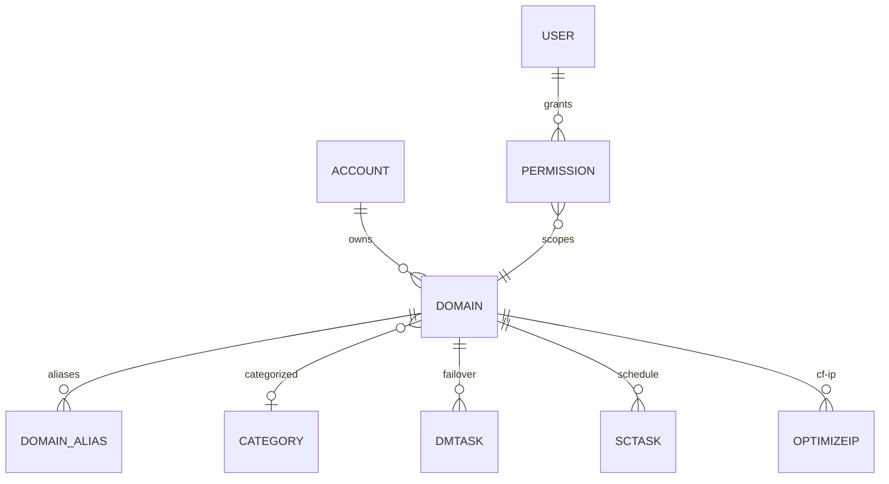

# DNS 账户与域名

系统把「云厂商账号」和「该账号下的域名」拆成两层：账户存密钥，域名绑定账户后再管解析记录。容灾、定时切换、优选 IP、证书 DNS-01 都通过域名行找到对应账户与厂商 SDK。

## 什么是 DNS 账户与域名？

**DNS 账户**是一条 `account` 表记录：`type` 对应 `lib/dns/factory.ts` 的厂商键，`config` 为加密后的 JSON（AccessKey 等）。

**域名**是一条 `domain` 表记录：`aid` 指向账户，`name` 为根域，`thirdid` 为厂商侧域名 ID。普通用户对域名的可见与可写范围由 `permission` 决定。

**关键特征**:
- 22 个厂商实现同一套 `DnsProvider` 接口
- 解析记录不落本地库，实时读写厂商 API
- 删除域名会级联 alias、容灾任务、优选 IP、定时切换、劫持检测任务

## 代码位置

| 方面 | 位置 |
|------|------|
| 类型 | `backend/src/lib/dns/types.ts` |
| 工厂 | `backend/src/lib/dns/factory.ts` |
| 实现 | `backend/src/lib/dns/providers/*.ts` |
| 路由 | `backend/src/routes/account.ts`、`domain.ts` |
| 权限 | `backend/src/auth.ts`（`getUserPermissions` / `matchPermission`） |
| 表 | `{prefix}account`、`domain`、`domain_alias`、`domain_category`、`permission` |

## 结构

```typescript
interface DomainInfo {
  DomainId: string;
  Domain: string;
  RecordCount: number;
}

interface RecordInfo {
  RecordId: string;
  Domain: string;
  Name: string;
  Type: string;
  Value: string;
  Line: string;
  TTL: number;
  MX: number | null;
  Status: string;
  Weight: number | null;
  Remark: string | null;
}
```

### 关键字段（表 `domain`）

| 字段 | 类型 | 描述 |
|------|------|------|
| `id` | uint | 本地主键 |
| `aid` | uint | DNS 账户 ID |
| `name` | varchar | 根域 |
| `thirdid` | varchar | 厂商域名 ID |
| `is_notice` | tinyint | 是否纳入到期提醒 |
| `expiretime` | datetime | 到期时间 |

### 权限字段（表 `permission`）

| 字段 | 描述 |
|------|------|
| `uid` | 用户 ID |
| `domain` | 根域 |
| `sub` | 空=整域；否则仅该主机及其下级 |
| `readonly` | 1=只读 |
| `expiretime` | 授权过期；过期行不参与匹配 |

`matchPermission` 返回 0 可写、1 只读、-1 无权限。`isRecordInScope` 把 `@` 视为空主机名。

## 不变量

1. **账户 type 必须在 factory 中**: `getDnsProvider` 对未知 type 返回 `false`
2. **密钥不明文回显**: 列表/详情走 `maskConfig`
3. **子用户不能越权改记录**: 路由按 `permission` 过滤主机名

## 生命周期



## 关系



厂商键列表见 [接口文档](../INTERFACES.md#dns-账户)。
