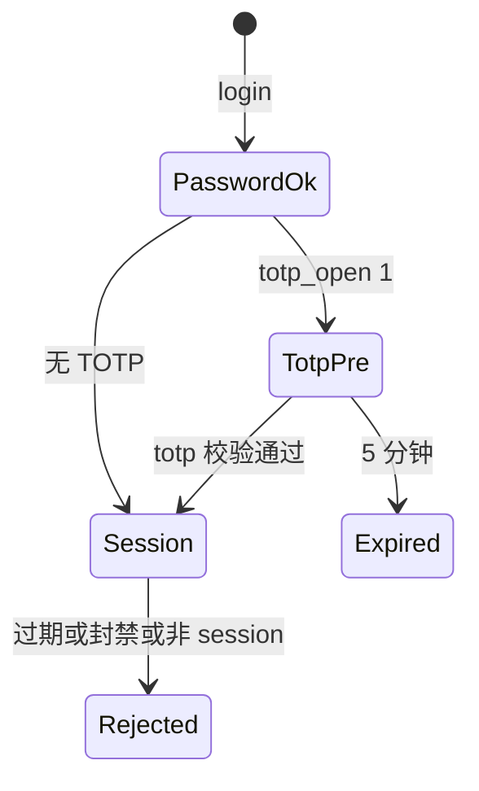

# 凭据加密与会话

账户密钥、TOTP 种子、证书扩展字段在数据库中加密；浏览器只拿 JWT 会话令牌。安装时生成的 `sys_key` 既是 JWT 密钥，也是 AES 派生材料。

## 什么是凭据加密与会话？

**凭据加密**：`lib/secret.ts` 用 AES-256-GCM。明文 JSON 经 `encryptConfig` 后形如 `enc:v1:<iv_b64>:<tag_b64>:<data_b64>`。密钥 = `sha256('dnsmgr-config:' + sys_key)`。历史明文仍可 `decryptConfig` 解析，下次保存自动转密文。

**会话**：`@fastify/jwt`，secret 为 `sys_key`，默认 `expiresIn: '7d'`。payload 含 `uid`、`username`、`level`、`totp_open`、`type`。

**关键特征**:
- `sys_key` 存 `config` 表，`GET /api/system/settings` 不返回该键
- 敏感字段名由 `isSecretKey` 正则识别（secret/password/token/apikey/AccessKeyId 等）
- TOTP 预令牌 `type: 'totp_pre'` 有效期 5 分钟，不能通过 `authenticate`
- 关闭/绑定 TOTP 必须再校验登录密码

## 代码位置

| 方面 | 位置 |
|------|------|
| 加解密 | `backend/src/lib/secret.ts` |
| JWT 与 authenticate | `backend/src/index.ts` |
| 登录 | `backend/src/routes/auth.ts` |
| 用户查询 | `backend/src/auth.ts` |
| TOTP | `backend/src/lib/totp.ts` |
| 前端存储 | `frontend/src/api.ts`（`dnsmgr_token` / `dnsmgr_user`） |

## 结构

```typescript
function deriveKey(): Buffer {
  return createHash('sha256').update('dnsmgr-config:' + secretKey).digest();
}

// authenticate 拒绝条件：jwt 失败、type 非 session、uid 空、用户不存在或 status=0
```

### 用户字段

| 字段 | 描述 |
|------|------|
| `id` | 主键，表 `AUTO_INCREMENT=1000` |
| `password` | bcrypt（异步，cost 10） |
| `level` | `>=2` 管理员 |
| `status` | 0 封禁 |
| `totp_open` / `totp_secret` | 二次验证；secret 加密 |
| `is_api` / `apikey` | API 访问（表字段存在） |

密码策略：安装、建用户、注册、改密均至少 8 位。超管密码仅本人可改。

## 不变量

1. **未 setSecretKey 时 encrypt 退化为明文**，避免写成无法解密的数据
2. **decrypt 失败返回 null**，不抛给路由
3. **封禁即时生效**：authenticate 每次（缓存最多 10 秒）读库 `status`
4. **登录失败文案在验密前不区分用户是否存在**；封禁提示放在密码正确之后，降低用户名枚举

## 生命周期


