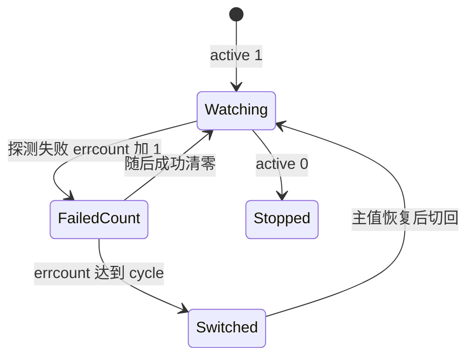

# 容灾切换

容灾任务按固定频率探测主值可用性，失败达到阈值后把解析切到备值（或暂停记录），恢复后再切回，并通过 `msgNotice` 发多通道告警。

## 什么是容灾切换？

`dmtask` 一行绑定某个域名的一条记录（`did` + `rr` + `recordid`）。调度器每秒取出 `checknexttime <= now` 且 `active=1` 的任务，异步跑 `runMonitorTask`，并把下次检查设为 `now + frequency`。

**关键特征**:
- 探测：ping / tcp / http(s)，实现于 `lib/monitor/checkUtils.ts`
- 连续失败 `cycle` 次才切换；`errcount` 记当前失败次数
- 目标 URL 受 SSRF 约束（`netGuard.ts`）
- 日志在 `dmlog`；`run_time` / `run_count` 写入 `config` 表供概览页

## 代码位置

| 方面 | 位置 |
|------|------|
| 调度 | `backend/src/lib/monitor/scheduler.ts` |
| 执行 | `backend/src/lib/monitor/taskRunner.ts` |
| 探测 | `backend/src/lib/monitor/checkUtils.ts` |
| 通知 | `backend/src/lib/monitor/msgNotice.ts` |
| 路由 | `backend/src/routes/dmonitor.ts` |
| 表 | `dmtask`、`dmlog` |

## 结构

### 任务字段（`dmtask`）

| 字段 | 描述 |
|------|------|
| `did` | 域名 ID |
| `rr` | 主机名 |
| `recordid` | 厂商记录 ID |
| `type` | 切换策略类型 |
| `main_value` / `backup_value` | 主/备解析值 |
| `checktype` | 探测协议 |
| `checkurl` / `tcpport` | HTTP URL 或 TCP 端口 |
| `frequency` | 间隔秒 |
| `cycle` | 确认失败次数 |
| `timeout` | 超时 |
| `proxy` / `cdn` | 是否走代理、是否 CDN 场景 |
| `active` | 启用 |
| `status` | 当前主/备状态 |

## 不变量

1. **调度单线程 tick**: `running` 标志防止重叠
2. **默认禁止探测内网 IP / 云元数据地址**
3. **切换实际改的是厂商解析，不是本地假数据**

## 生命周期

相关：定时切换（`sctask` + `lib/schedule/scheduleService.ts`，60 秒）按日历改记录，不做探测。
