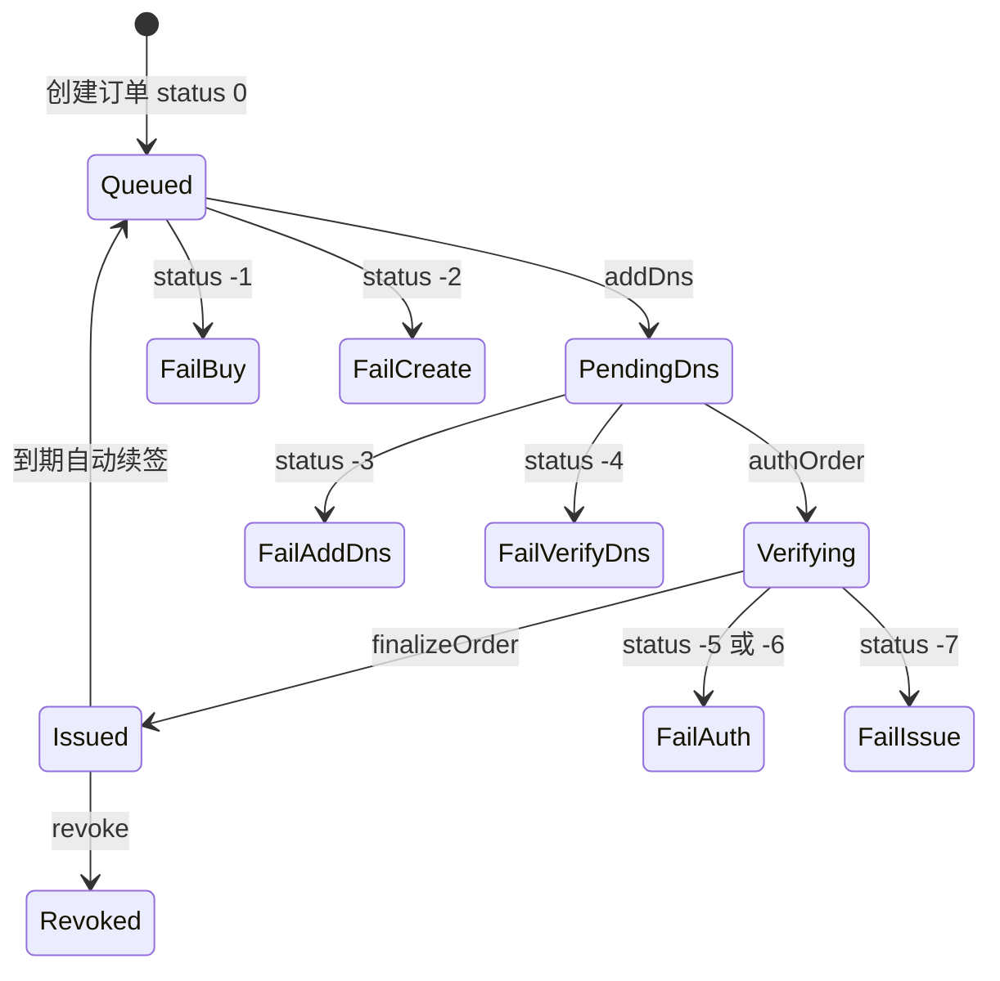

# 证书订单

证书订单描述一次签发过程：选账户（Let's Encrypt 等 8 渠道）、填域名列表、经 DNS-01 验证后得到 `fullchain` 与 `privatekey`。可开自动续签；签发成功后可触发部署任务和 CDN certlink。

## 什么是证书订单？

`cert_order` 一行，加 `cert_domain` 多行 SAN。`status` 既表示阶段也表示失败原因（负值）。处理逻辑集中在 `CertOrderService.process()`，调度器 `certTaskRun` 每 5 分钟推进。

**关键特征**:
- ACME 渠道（class 1）与云厂商免费 SSL（class 2）共用同一状态机
- DNS 记录由 `lib/certDns.ts` 写到已纳管域名；也可用 `cert_cname` 委托
- `info` / `dns` / 账户 `ext` 加密存储
- 私钥与证书 PEM 存在订单行；PFX 导出调用系统 `openssl`，空密码表示无密码

## 代码位置

| 方面 | 位置 |
|------|------|
| 状态机 | `backend/src/lib/certService.ts` |
| 调度 | `backend/src/lib/cert/certTaskService.ts` |
| 工厂 | `backend/src/lib/cert/factory.ts` |
| ACME | `backend/src/lib/acme/ACMEv2.ts`、`ACMECert.ts` |
| 路由 | `backend/src/routes/cert.ts` |
| 表 | `cert_account`、`cert_order`、`cert_domain`、`cert_cname` |

## 结构

```typescript
export const STATUS_LABEL: Record<number, string> = {
  0: '待提交', 1: '待验证', 2: '正在验证', 3: '已签发', 4: '已吊销',
  [-1]: '购买证书失败', [-2]: '创建订单失败', [-3]: '添加DNS失败',
  [-4]: '验证DNS失败', [-5]: '验证订单失败', [-6]: '订单验证未通过',
  [-7]: '签发证书失败',
};
```

### 关键字段

| 字段 | 描述 |
|------|------|
| `aid` | 证书账户 |
| `status` | 见上表 |
| `isauto` | 自动续签 |
| `retry` / `retry2` | 阶段内重试 / 整单重启次数，上限 3 |
| `islock` / `locktime` | 处理锁 |
| `retrytime` | 下次调度时间（数据库时钟） |
| `link` | CDN 联动信息（迁移补列） |
| `fullchain` / `privatekey` | 签发结果 |

## 不变量

1. **status>=3 不再 process**: 已签发/吊销直接返回
2. **非手动且 retry2>=3 放弃**
3. **签发成功后重置关联部署任务 status=0**，让部署调度接手
4. **未知证书 type 在创建账户时先查 `certConfig[type]`**，给出友好错误

## 生命周期



续签条件：`isauto=1` 且 `status=3` 且 `expiretime <= NOW() + N DAY`（设置项，订单列表侧还有 7 天窗口逻辑）。运行窗口由 `cert/settings` 的小时区间控制，支持跨天。
