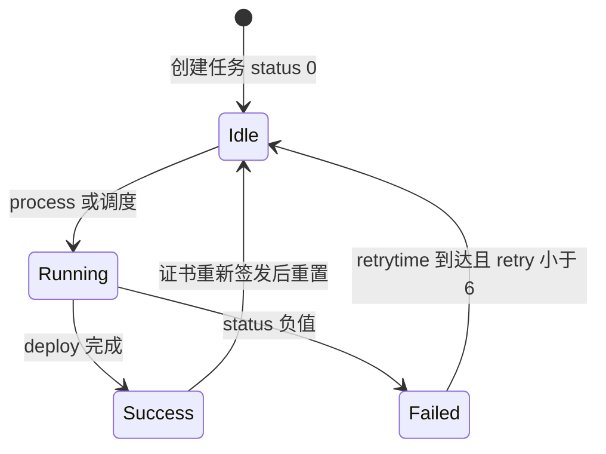

# 部署任务

部署任务把已签发订单的证书推到面板、对象存储、云 CDN、SSH/FTP 等目标。账户与任务分离：账户存登录凭据，任务存目标站点/证书名等 `taskinputs`。

## 什么是部署任务？

`cert_deploy` 一行：`aid` 部署账户，`oid` 证书订单。启用且订单 `status=3` 时，调度器调用 `CertDeployService` → `getDeployProvider(type).deploy(fullchain, privatekey, config, info)`。

**关键特征**:
- 49 个 type，元数据在 `lib/deploy/meta.ts`（class 1 自建 / 2 云 / 3 服务器）
- `config` 加密存储；接口回显掩码
- `cmd` / `cmd_pre` 默认拒绝，需 `DNSMGR_ALLOW_DEPLOY_CMD=1`
- 部署失败最多重试 6 次（`DEPLOY_MAX_RETRY`）

## 代码位置

| 方面 | 位置 |
|------|------|
| 服务 | `backend/src/lib/deployService.ts` |
| 工厂 | `backend/src/lib/deploy/factory.ts` |
| 元数据 | `backend/src/lib/deploy/meta.ts` |
| 命令门禁 | `backend/src/lib/deploy/commandGuard.ts` |
| 路由 | `backend/src/routes/cert.ts` 中 `/api/deploy/*` |
| 表 | `cert_account`（`deploy=1` 表示部署账户）、`cert_deploy` |

证书账户表同时容纳「签发账户」和「部署账户」，用字段 `deploy` 区分。

## 结构

```typescript
interface DeployProvider {
  check(): Promise<void>;
  deploy(fullchain: string, privatekey: string, config: Record<string, any>, info: any): Promise<void>;
  setLogger(func: (txt: string) => void): void;
}
```

### 任务字段

| 字段 | 描述 |
|------|------|
| `aid` | 部署账户 |
| `oid` | 证书订单 |
| `config` | 任务级参数（站点名、路径等） |
| `active` | 是否随续签自动部署 |
| `status` | 0 待执行；负值失败 |
| `retry` / `retrytime` | 重试 |
| `islock` | 执行锁 |

## 不变量

1. **只部署已签发且 PEM 非空的订单**
2. **自定义命令必须显式开环境变量**
3. **未知 type：`getDeployProvider` 返回 null**

## 生命周期


