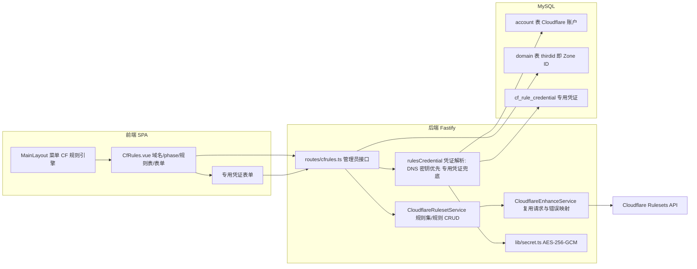

# Cloudflare 规则引擎（移植）技术设计

Feature Name: cloudflare-rules-engine
Updated: 2026-09-30

## Description

从 cf-manager 移植 Cloudflare 规则引擎到彩虹 DNS Pro 的 CDN 管理模块。规则引擎基于 Cloudflare Rulesets API，按 phase 组织规则，提供规则列表、新增、编辑、删除，以及表达式构建与高级 JSON 两种录入方式。

移植范围严格限定为**规则引擎**：不移植 cf-manager 的隧道管理、自定义主机名、DNS 记录 CRUD、Workers/Pages、存储、AI、浏览器渲染、商店等模块。

凭证策略：
- 默认复用本系统 Cloudflare DNS 账户已保存的凭证（`account.config` 的 `email`/`apikey`/`auth`）。
- 当 DNS 凭证权限不足时，接口返回「需要专用凭证」，前端在规则引擎页面展示专用凭证表单；校验通过后以 AES-256-GCM 加密、按 Cloudflare 账户维度落库，后续优先使用。

## Architecture



## Scope

- 移植：8 类 phase 的规则读取/新增/编辑/删除、表达式构建、结构化表单、高级 JSON、按作用域的 ruleset 定位。
- 不移植：cf-manager 的 account/auth、tunnel、hostnames、dns、worker、pages、storage、ai、browser-render、store、i18n（本项目用中文硬编码文案）。
- 复用：本项目已有的 Cloudflare 凭证模型与 `CloudflareEnhanceService` 请求/错误基础设施、`lib/secret.ts`、`ResponsiveDataTable` 等 UI 资产。

## Phase 映射

八类规则与作用域、默认 action、结构化字段、所需 Cloudflare 令牌权限：

| 规则 | phase | 作用域 | kind | 默认 action | 结构化字段 | 令牌权限（提示用） |
|------|-------|--------|------|-------------|-----------|------------------|
| 回源 | `http_request_origin` | 站点级 | zone | `route` | `origin.port` | Origin Rules Write |
| 重定向 | `http_request_dynamic_redirect` | 站点级 | zone | `redirect` | `from_value.target_url` / `from_value.status_code` | Dynamic URL Redirects Write |
| URL 重写 | `http_request_transform` | 站点级 | zone | `rewrite` | `uri.path.expression` 或 `uri.query.expression` | Zone Transform Rules Write |
| 请求头转换 | `http_request_late_transform` | 站点级 | zone | `rewrite` | `headers.request.{set/add/remove}` | Zone Transform Rules Write |
| 响应头转换 | `http_response_headers_transform` | 站点级 | zone | `rewrite` | `headers.response.{set/add/remove}` | Zone Transform Rules Write |
| 缓存设置 | `http_request_cache_settings` | 站点级 | zone | `set_cache_settings` | `cache`、`edge_ttl` | Cache Settings Write |
| 防火墙 | `http_request_firewall_custom` | 站点级 | zone | `block` | 无 | Zone WAF Write |
| 速率限制 | `http_ratelimit` | 站点级 | zone | `block`/`challenge`/`js_challenge` | `characteristics`、`period`、`requests_per_period`、`mitigation_timeout` | Zone WAF Write |

> 与 cf-manager 的差异：cf-manager 将 `http_request_redirect` 归为**账户级**（kind `root`）。Cloudflare 官网 Single Redirects 使用**站点级** `http_request_dynamic_redirect`，且 action_parameters 为 `from_value.target_url`。本设计默认采用 Cloudflare 官方形态（站点级 + `target_url`），并把「phase → 作用域/权限」抽成单一映射表以便调整。详见「开放问题」。

## Components and Interfaces

### 1. `backend/src/lib/cloudflare/ruleset.ts`（新增）

`CloudflareRulesetService`，持有 `CloudflareEnhanceService` 实例与目标 Zone/Account 信息：

```ts
export interface RulesetScope { kind: 'zone' | 'account'; zoneId?: string; accountId?: string; }
export interface GenericRuleInput {
  description?: string;
  expression: string;
  action: string;
  action_parameters: Record<string, any>;
  enabled?: boolean;
}

export class CloudflareRulesetService {
  constructor(private cf: CloudflareEnhanceService, private scope: RulesetScope) {}
  listRules(phase: string): Promise<any[]>;          // 不存在则返回 []，读取不写库
  createRule(phase: string, input: GenericRuleInput): Promise<any>; // 不存在则创建空 ruleset
  updateRule(phase: string, ruleId: string, input: GenericRuleInput): Promise<any>;
  deleteRule(phase: string, ruleId: string): Promise<any>;
  probe(phase: string): Promise<{ ok: boolean; status: number; message?: string }>;
}
```

依赖：`CloudflareEnhanceService` 暴露一个受控的公共 API 调用入口（新增 `apiRequest(method, path, query?, body?, allowNotFound?)` 公开方法，内部复用现有私有 `requestRaw`），或由 `ruleset.ts` 直接组合现有公开方法。实现上选择在 `enhance.ts` 增加薄封装 `apiRequest`，避免复制鉴权/代理/错误逻辑。

### 2. `backend/src/lib/cloudflare/rulesCredential.ts`（新增）

凭证解析与专用凭证存取：

```ts
export interface CfCredentialSource { source: 'dns' | 'dedicated'; config: Record<string, any>; }
export async function resolveCredential(aid: number): Promise<CfCredentialSource>; // 专用优先，其次 DNS 账户
export async function getDedicatedCredential(aid: number): Promise<Record<string, any> | null>;
export async function saveDedicatedCredential(aid: number, config: Record<string, any>): Promise<void>;
export async function removeDedicatedCredential(aid: number): Promise<void>;
export async function hasDedicatedCredential(aid: number): Promise<boolean>;
```

### 3. `backend/src/routes/cfrules.ts`（新增，管理员）

| 方法 | 路径 | 说明 |
|------|------|------|
| GET | `/api/cf-rules/domains` | 列出 Cloudflare 域名（id 名 aid zoneId accountName） |
| GET | `/api/cf-rules/credential?aid=` | 查询某账户凭证来源与掩码 |
| POST | `/api/cf-rules/credential` | 校验并保存专用凭证 |
| DELETE | `/api/cf-rules/credential?aid=` | 移除专用凭证 |
| GET | `/api/cf-rules/rules?domainId=&phase=` | 规则列表；权限不足返回 `needCredential` |
| POST | `/api/cf-rules/rules` | 新增规则 |
| PUT | `/api/cf-rules/rules/:ruleId` | 更新规则 |
| DELETE | `/api/cf-rules/rules/:ruleId?domainId=&phase=` | 删除规则 |

管理员校验沿用 `cdn.ts` 模式：`preHandler` 内 `authenticate` 后 `checkLevel(req.user, 2)`，否则 `403`。

### 4. `backend/src/index.ts`

在 `if (installed)` 分支注册 `cfrulesRoutes`。

### 5. `backend/src/migrate.ts`

幂等创建专用凭证表。

### 6. 前端

- `frontend/src/views/CfRules.vue`（新增）：域名选择 + phase 选择 + 权限横幅 + 规则表 + 规则弹窗（结构化表单 + 高级 JSON + 表达式预览）+ 专用凭证弹窗。
- `frontend/src/router.ts`：新增 `cf-rules` 路由。
- `frontend/src/layouts/MainLayout.vue`：`CDN 管理` 分组新增「CF 规则引擎」；`activeKey` 匹配列表补充 `cf-rules`。
- `frontend/src/lib/admin.ts`：`ADMIN_PREFIXES` 增加 `/cf-rules`。
- `frontend/src/views/RecordList.vue`：Cloudflare 域名行在「自定义主机名」旁新增「规则引擎」跳转 `/cf-rules?domain=<id>`（可选入口，与现有 Cloudflare 入口一致）。

## Data Models

### 表 `cf_rule_credential`

| 字段 | 类型 | 说明 |
|------|------|------|
| `id` | int pk auto | 主键 |
| `aid` | int unique | 关联 `account.id`（Cloudflare 账户） |
| `config` | text | 加密 JSON：`{ auth, email, apikey, account_id? }` |
| `addtime` | datetime | 创建时间 |
| `updatetime` | datetime | 更新时间 |

建表语句（`migrate.ts` 幂等）：

```sql
CREATE TABLE IF NOT EXISTS {prefix}cf_rule_credential (
  id int(11) unsigned NOT NULL AUTO_INCREMENT,
  aid int(11) unsigned NOT NULL,
  config text NOT NULL,
  addtime datetime NOT NULL,
  updatetime datetime DEFAULT NULL,
  PRIMARY KEY (id),
  UNIQUE KEY aid (aid)
) ENGINE=InnoDB DEFAULT CHARSET=utf8mb4
```

### Cloudflare 规则对象（透传）

```ts
interface CfRule {
  id: string;
  description?: string;
  expression: string;
  action: string;
  action_parameters: Record<string, any>;
  enabled: boolean;
}
```

## Correctness Properties

1. **凭证优先级不变量**：同一账户同时存在专用凭证与 DNS 凭证时，规则接口始终使用专用凭证；移除专用凭证后回退 DNS 凭证。
2. **读取无副作用**：`listRules` 对不存在的 ruleset 返回空数组，不创建资源；仅写操作创建空 ruleset。
3. **作用域唯一**：每次调用恰好使用 `zone_id` 或 `account_id` 之一，规则集 `kind` 与之匹配。
4. **表达式非空**：创建/更新规则时表达式必须非空。
5. **敏感不回显**：专用凭证的密钥字段以掩码返回；错误信息不含凭证。
6. **管理员边界**：所有 `/api/cf-rules/*` 在非管理员下返回 403。

## Error Handling

- Cloudflare 响应统一经 `CloudflareEnhanceService.throwActionError` 映射：401 凭证无效/过期、403 权限不足（附所需权限名）、404 资源不存在、429 频率限制、5xx 服务不可用。
- 权限不足（403）时，`GET /api/cf-rules/rules` 等返回 `{ code: -1, msg, data: { needCredential: true, aid } }`，前端据此弹出专用凭证表单。
- 专用凭证校验：先 `GET /zones`（辨别凭证可用性）再对目标 phase 执行 `dry_run` 或 `listRules`，二者通过才落库。

## Test Strategy

- `cd backend && npx tsc --noEmit` 与 `cd frontend && npx vue-tsc --noEmit` 必须通过。
- `cd frontend && npm run build` 必须成功。
- 后端无库启动冒烟：进程启动，`/api/health`、`/api/setup/status` 正常。
- 纯函数单测建议（可选手写校验脚本）：表达式构建器（5 种 matchType）、phase→作用域映射、action_parameters 组装/解析。
- 真机联调（需具备相应权限的 Cloudflare 令牌，手动）：DNS 密钥复用路径、403 降级路径、专用凭证保存与优先级、8 类 phase 增删改查。

## Implementation Plan

1. 后端基础：`enhance.ts` 增加公共 `apiRequest` 封装。
2. `ruleset.ts`：phase→作用域/权限映射、ruleset 定位/创建、规则 CRUD、`probe`。
3. `migrate.ts`：新增 `cf_rule_credential` 表；`rulesCredential.ts`：凭证解析与加解密存取。
4. `routes/cfrules.ts`：8 个接口 + 管理员校验 + 错误映射；`index.ts` 注册。
5. 前端 `CfRules.vue`：域名/phase 选择、规则表、结构化表单、高级 JSON、表达式预览、专用凭证表单。
6. 前端接线：`router.ts`、`MainLayout.vue`、`lib/admin.ts`，以及 `RecordList.vue` 入口按钮。
7. 更新 `.monkeycode/docs/INTERFACES.md` 与相关模块文档。
8. 验证：tsc / vue-tsc / build / 启动冒烟。

## Design Decisions (Confirmed 2026-09-30)

1. **重定向 phase**：采用 Cloudflare 官方的**站点级** `http_request_dynamic_redirect`，`action_parameters` 使用 `from_value.target_url` 与 `from_value.status_code`（不采用 cf-manager 的账户级 `http_request_redirect` + `from_value.target.url`）。
2. **入口形态**：侧栏「CDN 管理 → CF 规则引擎」菜单，同时在「解析记录」页为 Cloudflare 域名提供「规则引擎」跳转按钮（`/cf-rules?domain=<id>`）。
3. **专用凭证绑定粒度**：按 Cloudflare 账户绑定，唯一键为 `account.id`，同账户下所有域名共用一份专用凭证。

## References

[^1]: (Repository) - [cf-manager](https://github.com/hefy2027/cf-manager)
[^2]: (cf-manager) - [rulesetService.ts](https://github.com/hefy2027/cf-manager/blob/main/backend/src/services/rulesetService.ts)
[^3]: (cf-manager) - [TunnelsView.vue 规则引擎段](https://github.com/hefy2027/cf-manager/blob/main/frontend/src/views/TunnelsView.vue)
[^4]: (Website) - [Cloudflare Rulesets API](https://developers.cloudflare.com/ruleset-engine/rulesets-api/)
[^5]: (Website) - [Cloudflare Single Redirects](https://developers.cloudflare.com/rules/url-forwarding/single-redirects/)
[^6]: (File) - [lib/cloudflare/enhance.ts](backend/src/lib/cloudflare/enhance.ts)
[^7]: (File) - [routes/cloudflare.ts](backend/src/routes/cloudflare.ts)
[^8]: (File) - [routes/cdn.ts](backend/src/routes/cdn.ts)